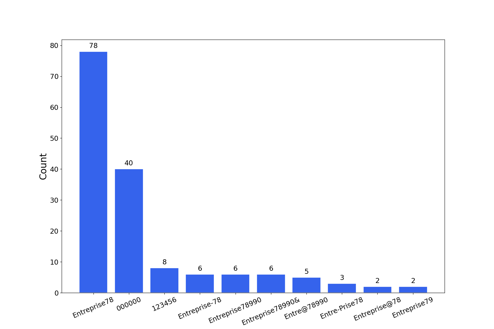

# graphcat.py

Simple script to generate graphs and charts on hashcat (and john) potfile and ntds.

## Table of Content

- [graphcat.py](#graphcatpy)
  - [Table of Content](#table-of-content)
  - [Install](#install)
  - [Helper](#helper)
  - [Usage](#usage)
  - [Format](#formats)
  - [Charts example](#charts-example)

## Install

```text
git clone https://github.com/Orange-Cyberdefense/graphcat
cd graphcat
pip install .
```

## Helper

```text
$ graphcat.py -h
usage: graphcat.py [-h] -potfile hashcat.potfile -hashfile hashfile.txt [-john] [-format FORMAT] [-export-charts] [-output-dir OUTPUT_DIR] [-debug]

Password Cracking Graph Reporting

options:
  -h, --help            show this help message and exit
  -potfile hashcat.potfile
                        Hashcat Potfile
  -hashfile hashfile.txt
                        File containing hashes (one per line)
  -john                 John potfile
  -format FORMAT        hashfile format (default 3): 1 for hash; 2 for username:hash; 3 for secretsdump (username:uid:lm:ntlm)
  -export-charts        Output also charts in png
  -output-dir OUTPUT_DIR
                        Output directory
  -debug                Turn DEBUG output ON
```

## Usage

Graphcat just need a potfile with `-potfile` (default is hashcat, but you can use `-john` to submit a john potfile) and a hashfile with `-hashfile`. The hashfile should be in a specific format from the [3 availables formats](#formats) with `-format` flag. Default is **Secretsdump**.

The tool will generate a report with multiple password cracking charts. You can get charts in png with the `-export-charts` flag.

```text
$ graphcat.py -hashfile entreprise.local.ntds -potfile hashcat.pot
[-] Parsing potfile
[-] 164 entries in potfile
[-] Parsing hashfile
[-] 1600 entries in hashfile
[-] Generating graphs...
[-] Generating report...
[-] Report available at graphcat_1672941324.pdf
```

### Formats

1: Only Hash

```text
aad3b435b51404eeaad3b435b51404ee
aad3b435b51404eeaad3b435b51404ee
aad3b435b51404eeaad3b435b51404ee
```

2: Username + Hash

```text
test1:aad3b435b51404eeaad3b435b51404ee
test2:aad3b435b51404eeaad3b435b51404ee
test3:aad3b435b51404eeaad3b435b51404ee
```

3: Secretsdump

```text
waza.local\test1:4268:aad3b435b51404eeaad3b435b51404ee:aad3b435b51404eeaad3b435b51404ee:::
waza.local\test2:4269:aad3b435b51404eeaad3b435b51404ee:aad3b435b51404eeaad3b435b51404ee:::
waza.local\test3:4270:aad3b435b51404eeaad3b435b51404ee:aad3b435b51404eeaad3b435b51404ee:::
```

If a hash occurs more than once in the hash file, it will be counted that many times.

Moreover, if you submit secretsdump with password history (`-history` in secretsdump command), it will analyze similarity in password history

## Charts example





